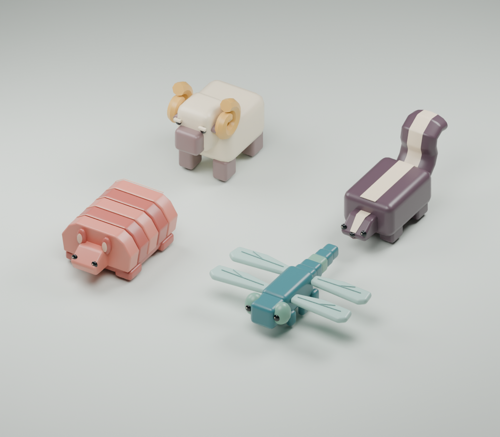

# Menagerie

**Hold. Wiggle. Stack.**

A phone-first 3D browser game about stacking colorful, living animal sculptures.
Steer each animal into a useful orientation, then release it onto the tower. Build the tallest collection you can without losing an animal.

## Status

The playable handling experiment includes tortoise, capybara, toucan, red armadillo, dragonfly, ram, and lower-tail skunk. The next animal waits visibly above the stack in a random three-dimensional orientation. Hold to take control, drag to steer its rotation rate, return toward the starting point to steady it, then release to drop. A shuffled bag presents all seven species before repeating. Placement is temporarily locked over the stack so this experiment isolates rotation control. Each animal has its own compound Rapier collider and balance profile. The build also includes automatic placement height, platform-contact fall detection, an orthographic tracking camera, score, game over, and play again.

The animated startup gesture cue has been replaced by a brief goal and three compact written instructions in the concept study's restrained, letter-spaced typographic style. They fade after the first successful landing, leaving only the score and restart control.

**Live:** https://fidgetbot.github.io/menagerie/


- [Editable Blender scene](assets/source/menagerie-lineup-v01.blend)
- Close-ups: [Tortoise](assets/previews/tortoise-detail-v01.png) · [Capybara](assets/previews/capybara-detail-v01.png) · [Toucan](assets/previews/toucan-detail-v01.png)
- [Asset notes and regeneration](assets/README.md)



[Editable expansion scene](assets/source/menagerie-final-expansion.blend)

See [SPEC.md](SPEC.md) for the agreed direction, scope, and implementation milestones.

## Technology

TypeScript, Vite, Three.js, and Rapier. All seven animals are exported from Blender as GLB. GitHub Actions deploys the static browser build to GitHub Pages; gameplay runs entirely on the client. Generated sound effects, music, and fuller character animation remain planned.

## Local development

```sh
npm install
npm run dev
```

Use `npm run build` to run the TypeScript check and create the Pages artifact in `dist/`.

## Expansion regression

Start the dev server, then run `npx playwright install webkit` once and
`npm run test:expansion`. The browser harness exercises all 49 ordered upright
pairings and twelve tilted/inverted releases, waits ten seconds after resolution,
checks the flight recorder for upward anomalies, and verifies restart. Results
and phone screenshots go to ignored `tmp/expansion-test/`. Natural falls are
valid outcomes; unresolved turns, page exceptions, upward anomalies, and broken
resets fail the run. `TEST_URL` can target a different **development** server;
production deliberately excludes the deterministic orientation controls.
