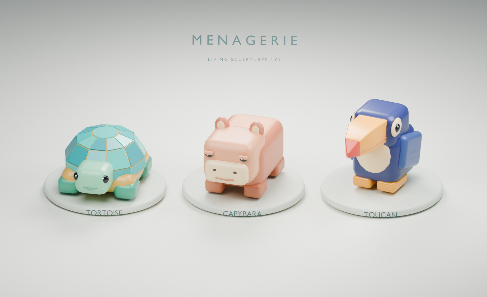

# Menagerie

**Hold. Wiggle. Stack.**

A phone-first 3D browser game about stacking colorful, living animal sculptures.
Hold and position a squirming animal; release at the right moment to drop it in its current orientation. Build the tallest collection you can without losing an animal.

## Status

The first playable handling experiment is live. Press to summon the next tortoise, drag while it squirms through three-dimensional orientations, then release it onto the stack. The build uses the Blender character study with a simplified Rapier collider, automatic placement height, an orthographic tracking camera, score, and restart.

The gameplay screen intentionally contains no title or tagline—only the score, restart control, and a non-text gesture cue that disappears after the first touch.

**Live:** https://fidgetbot.github.io/menagerie/



- [Editable Blender scene](assets/source/menagerie-lineup-v01.blend)
- Close-ups: [Tortoise](assets/previews/tortoise-detail-v01.png) · [Capybara](assets/previews/capybara-detail-v01.png) · [Toucan](assets/previews/toucan-detail-v01.png)
- [Asset notes and regeneration](assets/README.md)

See [SPEC.md](SPEC.md) for the agreed direction, scope, and implementation milestones.

## Technology

TypeScript, Vite, Three.js, and Rapier. The current tortoise is exported from Blender as GLB. GitHub Actions deploys the static browser build to GitHub Pages; gameplay runs entirely on the client. Generated sound effects, music, and fuller character animation remain planned.

## Local development

```sh
npm install
npm run dev
```

Use `npm run build` to run the TypeScript check and create the Pages artifact in `dist/`.
